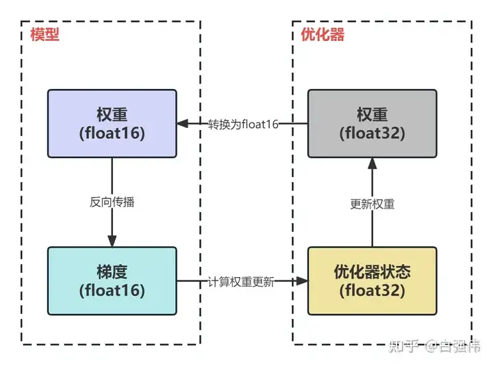

- [数据格式](#数据格式)
  - [fp16与bp16](#fp16与bp16)
  - [fp16与fp32](#fp16与fp32)
- [混合精度训练时的显存分析](#混合精度训练时的显存分析)
- [deepspeed与ZeRO](#deepspeed与ZeRO)

# 数据格式
## fp16与bp16
fp16即float16数据类型。之前我介绍过float32类型：

【模型量化系列1】Float数据类型介绍 - 武辰的文章 - 知乎

[武辰：【模型量化系列1】Float数据类型介绍](https://zhuanlan.zhihu.com/p/676689081)

再谈float32数据格式的精度问题 - 武辰的文章 - 知乎

[武辰：再谈float32数据格式的精度问题](https://zhuanlan.zhihu.com/p/689045851)

相比于float32，float16有着更小的数值范围和精度。float16，也被称为半精度浮点数，采用1位符号位，5位指数位，以及10位尾数（分数）位。由于其较小的尾数位和指数位，float16所能够表示的最大数值，最小数值，以及精度都小于float32。在某些对于计算精度要求不高，但对内存和计算性能要求较高的场景下，例如深度学习中的一些计算场景，float16可能会被优选使用。

float16 的精度大约为小数点后 3~4 位，表示范围是[-65504，65504]。

bfloat16（bp16）是由Google Brain开发的数据类型，采用1位符号位，8位指数位，以及7位尾数位。bp16的表示精度为小数点后2位，表示范围是[-3.40282e+38，3.40282e+38]。也就是说，bp16是以牺牲精度的代价，换来了表示范围的提升。这可以缓解数值溢出的问题。

## fp16与fp32
FP16的有效数据范围是 5.96 x 10^(-8) ~ 65504，而FP32的有效数据范围是 1.4 × 10^-45 ~ 1.7 × 10^38。如果使用FP16替换FP32，就可能导致上溢（Overflow）或下溢（Underflow）。

上溢是指当所处理的值大于fp16能够表示的最大值65504时，数值会溢出，可能导致结果不可预测或不正确。例如在训练神经网络时，如果参数更新的幅度过大，就可能导致上溢。

下溢是指当所处理的值小于fp16能够表示的最小值（绝对值）时（也就是接近于0的很小的正数，通常这些数可能导致被认为是0），这种情况下，小数可能会被舍为零，这种现象也称为下溢。比如在计算概率或者交叉熵损失等需要处理接近于0的小数的场景时，使用fp16可能会因下溢导致精度损失。

在fp16训练中，下溢的问题通常比上溢更为常见。这是因为在深度学习中，很多操作如softmax或者梯度计算等，可能会涉及到处理非常接近0的小数（神经网络的权重本身就比较小，梯度往往比权重更小）。在fp16精度下，这些非常小的数可能会被四舍五入为0，从而引发下溢。

相反，上溢情况较少，因为我们通常不会遇到需要表示的数值超过fp16可表示的最大值65504的场景。然而，如果遇到了，这依然可能导致问题，尤其是在计算梯度或者参数更新等需要大量运算的阶段。

# 混合精度训练时的显存分析
混合精度训练是一种同时使用单精度（FP32）和半精度（FP16）两种数据类型的训练方法。虽然神经网络模型训练通常使用单精度FP32，但在近年来，为了提高训练速度、减少内存，同时又不牺牲模型的精度，许多混合精度训练的技术被业界提出并应用。

混合精度训练下，显存占用的情况是怎样的？

参考文章：分析transformer模型的参数量、计算量、中间激活、KV cache - 回旋托马斯x的文章 - 知乎

[回旋托马斯x：分析transformer模型的参数量、计算量、中间激活、KV cache
2170 赞同 · 273 评论文章](https://zhuanlan.zhihu.com/p/624740065)

DeepSpeed之ZeRO系列：将显存优化进行到底 - basicv8vc的文章 - 知乎

[basicv8vc：DeepSpeed之ZeRO系列：将显存优化进行到底
1438 赞同 · 71 评论文章](https://zhuanlan.zhihu.com/p/513571706)

在神经网络的训练过程中，显存的使用主要由以下四部分组成：模型参数、前向计算过程中生成的中间激活结果、反向传播过程计算得到的梯度、优化器的状态信息。这里暂时不考虑中间激活结果。我们设模型参数的数量为Q，那么梯度的元素数量也为Q，而使用AdamW优化器时，这个优化器的状态信息数量为2Q。

在前向传播过程中，模型参数与其对应的梯度都以FP16的数据格式储存。而优化器的状态信息，包括一阶动量和二阶动量，是以FP32的数据格式储存的。为了防止在更新参数时产生舍入误差（因为 weight = weight - learning_rate * gradient 中，learning_rate * gradient 往往会非常小），优化器会再额外保留一份FP32格式的模型参数，用于进行精度较高的权重更新。

根据以上情况，我们大致计算一下显存的使用量。一份FP16格式的模型参数占用2Q字节，一份FP32的模型参数占用4Q字节，他们总共占用了6Q字节。然后，模型梯度以FP16格式存储，占用2Q字节。最后，包括FP32格式的一阶和二阶动量在内的优化器，总共占用8Q字节。所以，整体占用的显存为16Q字节。其中，优化器（包括一份FP32格式的模型参数在内）占用了12Q字节，也就是说，优化器实际上使用了75%的显存空间。

下图显示了混合精度训练的流程（图片来自于白强伟：【深度学习】混合精度训练与显存分析 https://zhuanlan.zhihu.com/p/608634079）：

以一个实际场景为例，假设我们有一个7GB的模型。如果我们仅以FP16的格式来加载这个模型，的确只需14GB的显存。但实际上，在训练过程中，会消耗高达112GB的显存。A100显卡的显存仅为80GB，因此，一张显卡无法容纳整个训练过程。更重要的是，此处我们并未考虑到中间激活值和显存碎片等其他因素，它们也会占用一部分显存。所以，实际的显存需求更大。

# deepspeed与ZeRO
我在这篇文章说过数据并行：

武辰：用简单的例子模拟并行训练(https://zhuanlan.zhihu.com/p/688487174)

数据并行训练的一个缺点在于，在多GPU系统中，每个GPU都需要存储一份完整的模型参数。例如，在单机8卡的训练环境中，每张显卡都会存储一份模型参数，这导致了7张显卡中的模型参数实际上是冗余的。为解决这一问题，微软开发了DeepSpeed库，其中包括了一项名为ZeRO（Zero Redundancy Optimizer）的技术，用于消除冗余参数，提升训练效率。（当然，deepspeed解决的可不止这一个问题）

DeepSpeed是一个高性能、大规模的深度学习训练优化库，可以加速实际深度学习工作负载，帮助开发者在较低成本下更高效地训练大型模型。

ZeRO的工作流程包含几个阶段：

ZeRO-1：优化器状态分区。它将优化器状态（一阶和二阶矩）跨多个GPU进行划分，以降低每个GPU上的存储和计算开销。
ZeRO-2：梯度划分。在此阶段，梯度被划分并跨多个GPU存储，从而降低单个GPU的显存需求。梯度聚合时，各部分梯度仅在需要计算权重更新时进行通信和聚合，减少了通信开销。
ZeRO-3：参数划分。这一阶段在多个GPU上对模型参数进行划分，每个GPU只存储一部分参数，进一步减轻了单个GPU的显存负担。与此同时，前向传播和反向传播仍然可以并行进行。
通过这些技术，DeepSpeed的ZeRO实现了对冗余参数的优化，提高了多GPU训练的效率，并使得在有限的计算资源下可以训练更大规模的模型。

关于ZeRO的具体机制，我将在后面的文章详细讲述。
